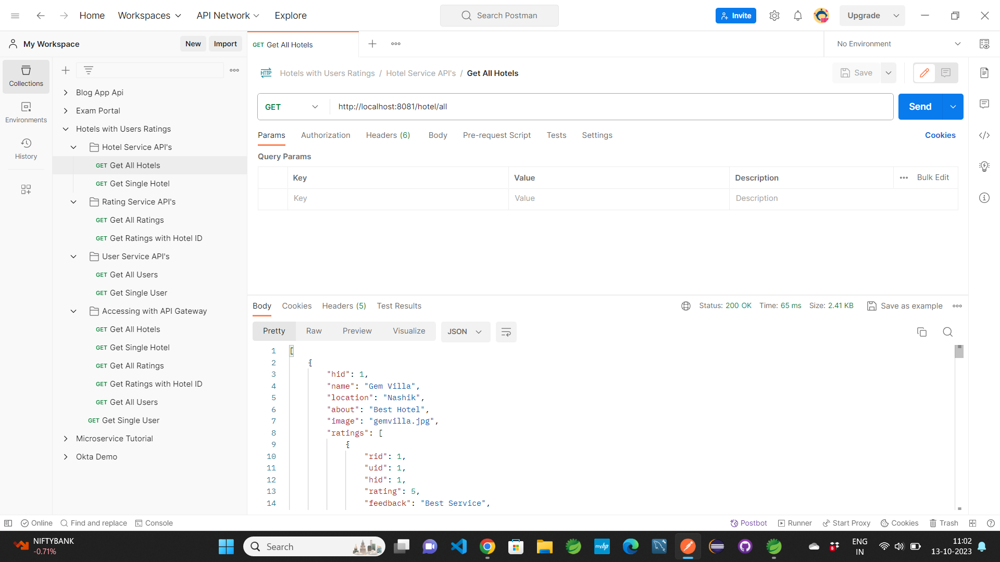
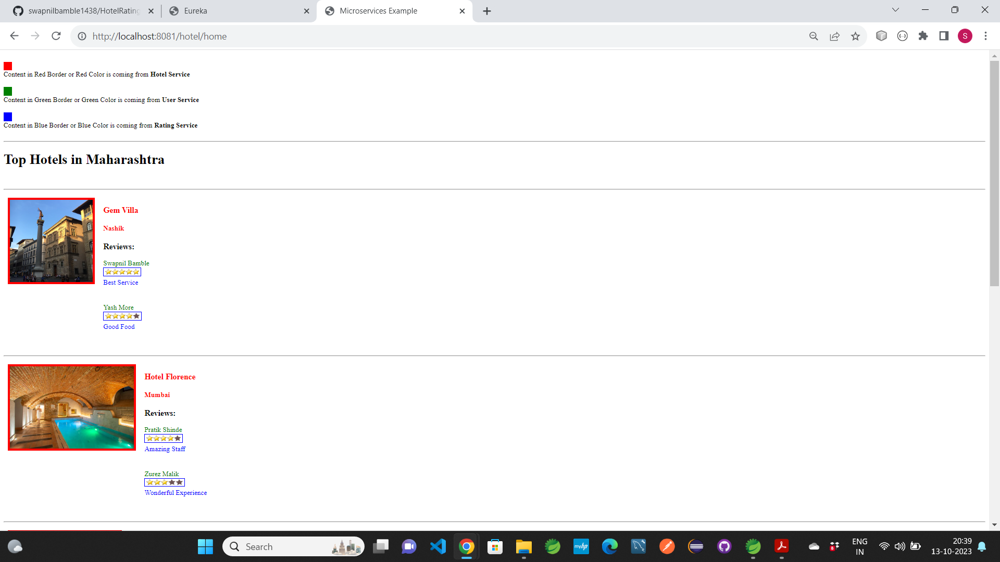
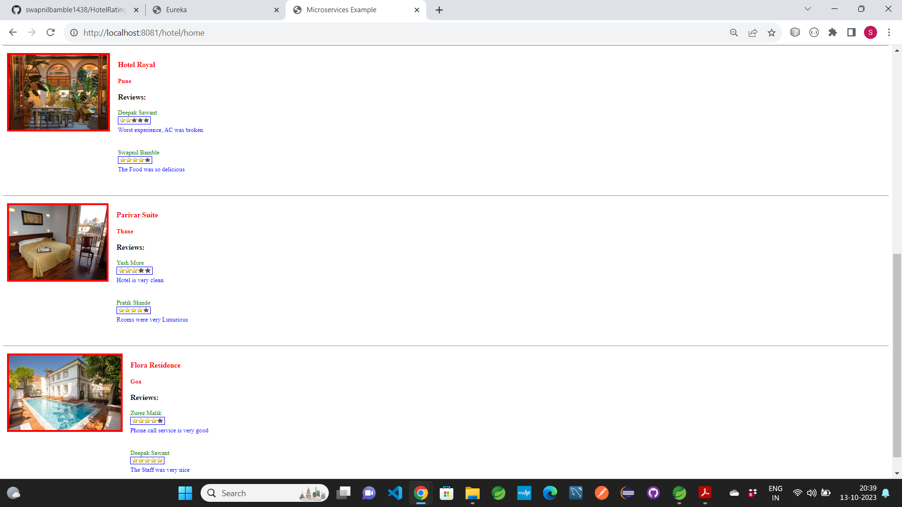

### It is SpringBoot Microservices Application with Thymeleaf Frontend. Build in Spring Tool Suite.

## HotelRatings
- It is a microservice project which shows the example of how microservices works.
-  It shows the connection and communication between multiple microservices.

-  In this project we can see the Hotel ratings which are given by users.
-  Where Hotel data is coming from Hotel microservice, Rating data is coming from Rating microservice and User data is coming from User microservice
-  No database has been used. the data is created in Java file only
-  You can simply download and run this project without any changes in configuration

 ## Try Api's in postman app as well as you can also try in Browser
 ## Frontend Page is also created, try accessing it by using localhost:8081/user/home or localhost:8084/user/home

### Some Screenshots of this Project:

==================================================================================================================================================================

==================================================================================================================================================================

==================================================================================================================================================================

### Project Creator: Swapnil Bamble

